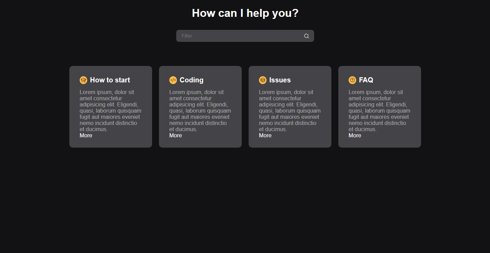

<!-- @import "[TOC]" {cmd="toc" depthFrom=1 depthTo=6 orderedList=false} -->

<!-- code_chunk_output -->

- [🚀 Tecnologias](#--tecnologias-)
- [🔖 Layout](#--layout-)

<!-- /code_chunk_output -->

<!-- /code_chunk_output -->
<h1 align="center"> Filtrando elementos na DOM com JavaScript PURO.</h1>

  <a href="#-tecnologias">Tecnologias</a>&nbsp;&nbsp;&nbsp;|&nbsp;&nbsp;&nbsp;
  <a href="#-layout">Layout</a>&nbsp;&nbsp;&nbsp;&nbsp;&nbsp;&nbsp;
 

  

 

  

## 🚀 Tecnologias

Esse projeto foi desenvolvido com as seguintes tecnologias:

- HTML e CSS
- JavaScript
- Git e Github

## 🔖 Layout

Créditos para Mayke Brito - Rocketseat: (https://www.rocketseat.com.br/)